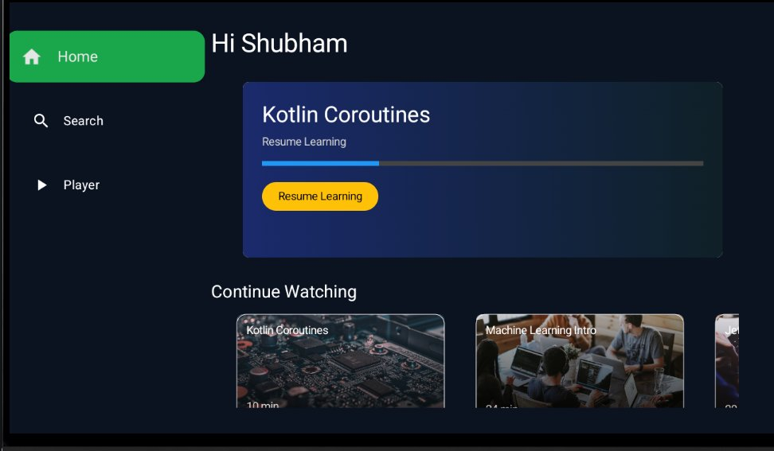
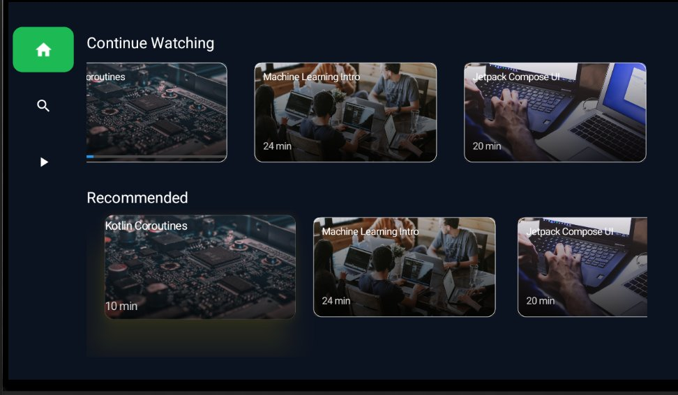
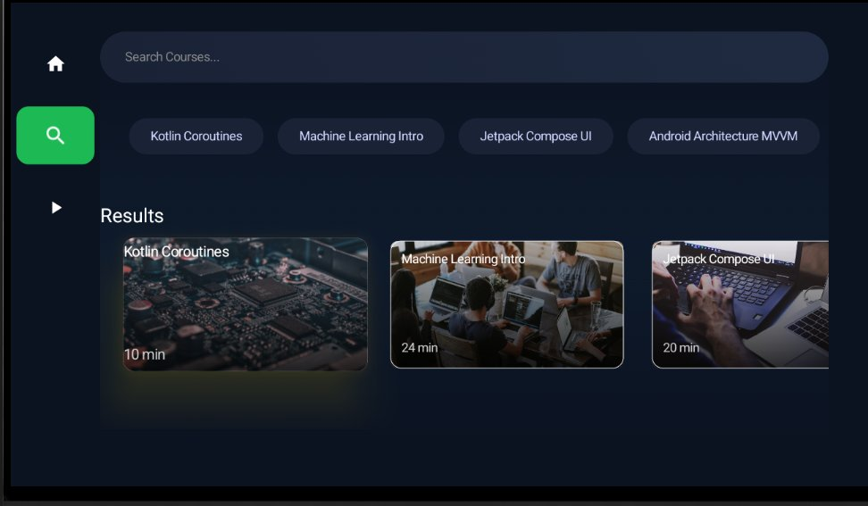
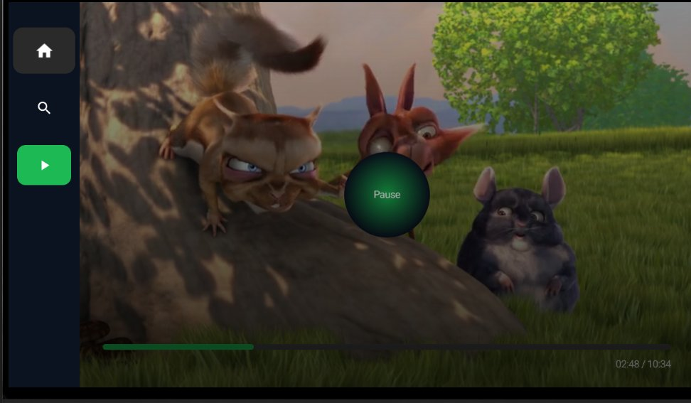
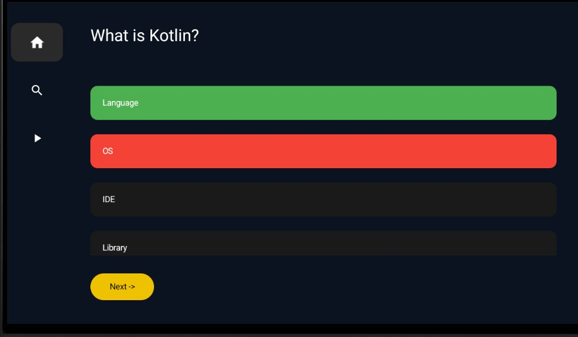
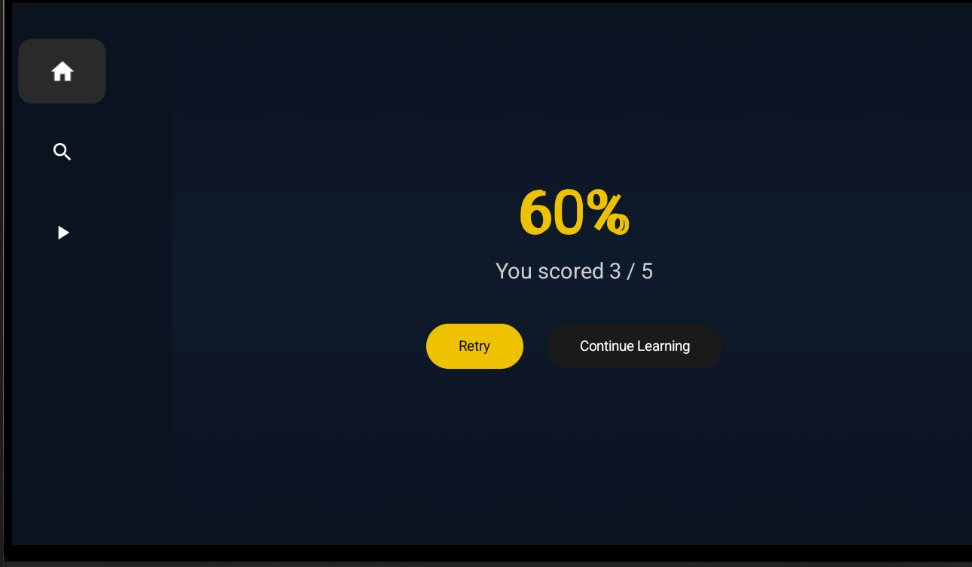

# 📺 Android TV Learning App

> A feature-rich Android TV application built as a **personal study project** to explore and deeply understand Android TV development — including Compose UI, ExoPlayer integration, Firebase backend, focus navigation, and quiz-based learning flows.

---

## 🎯 Why I Built This

Android TV development is a niche but powerful domain within the Android ecosystem. I built this project from scratch to go beyond surface-level knowledge — to genuinely understand how TV-specific UI components work, how focus navigation differs from mobile, and how to deliver a polished, remote-friendly experience. Every screen in this app reflects deliberate design decisions made with the TV form factor in mind.

---

## ✨ Features

### 🏠 Home Screen
- Personalized greeting with the user's name
- **"Resume Learning" hero banner** — shows the last watched course with a progress bar and a one-click resume button
- **Continue Watching** row — horizontally scrollable cards showing recently watched videos with remaining time
- **Recommended** row — Firebase-powered content suggestions

### 🔍 Search Screen
- **Suggestion chips** — quick-tap topic buttons (e.g., Kotlin Coroutines, Jetpack Compose UI, MVVM) for instant filtered results
- **Search input field** — real-time course search
- **Results grid** — displays matching courses with thumbnail, title, and duration

### ▶️ Video Player
- Powered by **ExoPlayer** — smooth, low-latency video playback
- Custom playback controls with **Pause overlay** (D-pad accessible)
- **Progress bar** with current time and total duration
- Seamless transition to quiz on video completion

### 🧠 Quiz Screen
- Automatically triggered after each video ends
- Multiple choice questions related to the video content
- Answers highlighted in **green (correct)** or **red (wrong)** with instant visual feedback
- **"Next ->"** button to navigate between questions

### 🏆 Score Screen
- Displays score percentage in large, clear typography
- Shows exact score (e.g., "You scored 3 / 5")
- Two action options: **Retry** the quiz or **Continue Learning**

---

## 📸 Screenshots

### Home Screen

> The home screen greets the user by name, shows the currently in-progress course with a visual progress bar and a "Resume Learning" CTA, followed by a horizontally scrollable "Continue Watching" row.

---

### Continue Watching & Recommendations

> Scrolling down on the home screen reveals the full "Continue Watching" section and a "Recommended" section — both powered by Firebase Firestore with real-time data.

---

### Search Screen

> The search screen features pre-defined topic chips for quick navigation, a text input field for freeform search, and a results grid that updates dynamically based on the query.

---

### Video Player

> ExoPlayer-powered full-screen video playback. The custom overlay shows a Pause button (D-pad focusable), a green progress bar, and a timestamp. Side navigation remains accessible at all times.

---

### Quiz Screen

> After the video ends, a quiz is automatically displayed. Each answer option is selectable via the D-pad remote. Correct answers turn green; wrong answers turn red — giving immediate feedback without needing a separate "Check Answer" button.

---

### Score Screen

> The results screen shows the percentage score prominently and gives the user two options: retry the quiz or continue to the next lesson.

---

## 🛠️ Tech Stack

| Technology | Purpose |
|---|---|
| **Kotlin** | Primary language |
| **Android TV ** | TV-optimized UI components through Compose |
| **ExoPlayer** | Video playback engine |
| **Firebase Firestore** | Course data, video metadata, quiz questions |
| **Firebase Auth** | User authentication and personalized progress |
| **Coroutines + Flow** | Async data handling |
| **ViewModel + LiveData** | UI state management |
| **MVVM Architecture** | Clean separation of concerns |

---

## 🧩 Key Android TV Concepts Implemented

- **D-pad Focus Navigation** — every interactive element is correctly focusable and navigable using a TV remote
- **Compose** — used for structured home screen rows (Continue Watching, Recommended)
- **Custom Presenter classes** — for rendering card views in Compose
- **ExoPlayer lifecycle management** — player properly pauses/resumes with Activity lifecycle, releases resources on destroy
- **TV-safe margins and overscan handling** — UI elements account for TV overscan zones
- **Side navigation rail** — persistent left navigation bar with Home, Search, and Player icons — always visible, focus-traversable
- **Firebase real-time updates** — Firestore listeners keep content fresh without manual refresh

---

## 🚀 Getting Started

1. Clone the repository
2. Add your `google-services.json` from Firebase Console to the `app/` directory
3. Set up Firestore with the following collections:
   - `courses` — course metadata (title, thumbnail, duration, videoUrl)
   - `quizzes` — questions per course (linked by courseId)
   - `userProgress` — per-user watch progress (linked by userId)
4. Build and run on an Android TV emulator or device (API 21+)

---

## 💡 What I Learned

- Android TV is fundamentally different from phone/tablet development — focus management is critical and must be explicitly designed
- ExoPlayer gives fine-grained control over playback that MediaPlayer simply can't match
- Firebase makes it easy to build a content backend quickly, but structuring Firestore for efficient queries on a TV (no infinite scroll, no pull-to-refresh) requires upfront planning
- Quiz-after-video is a powerful learning reinforcement pattern and surprisingly straightforward to implement once the player completion callback is properly hooked

---

## 📌 Note

This is a **personal learning project** built to explore the Android TV ecosystem end-to-end. It is not a production application. The goal was to understand every layer — from TV-specific UI to media playback to backend integration — with enough depth to build real TV apps confidently.

---

*Built with ❤️ to understand Android TV development from the ground up.*

